# Connectivity = how two LANs are made reachable using routers, across a WAN, securely and reliably.

## Now let’s break that into three real-world connectivity models.
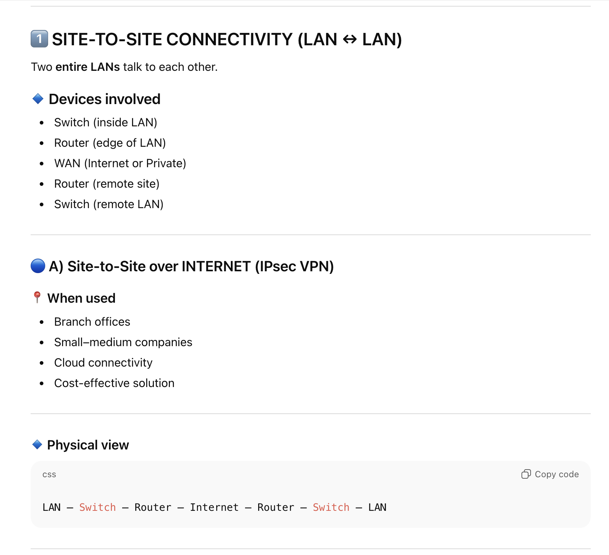
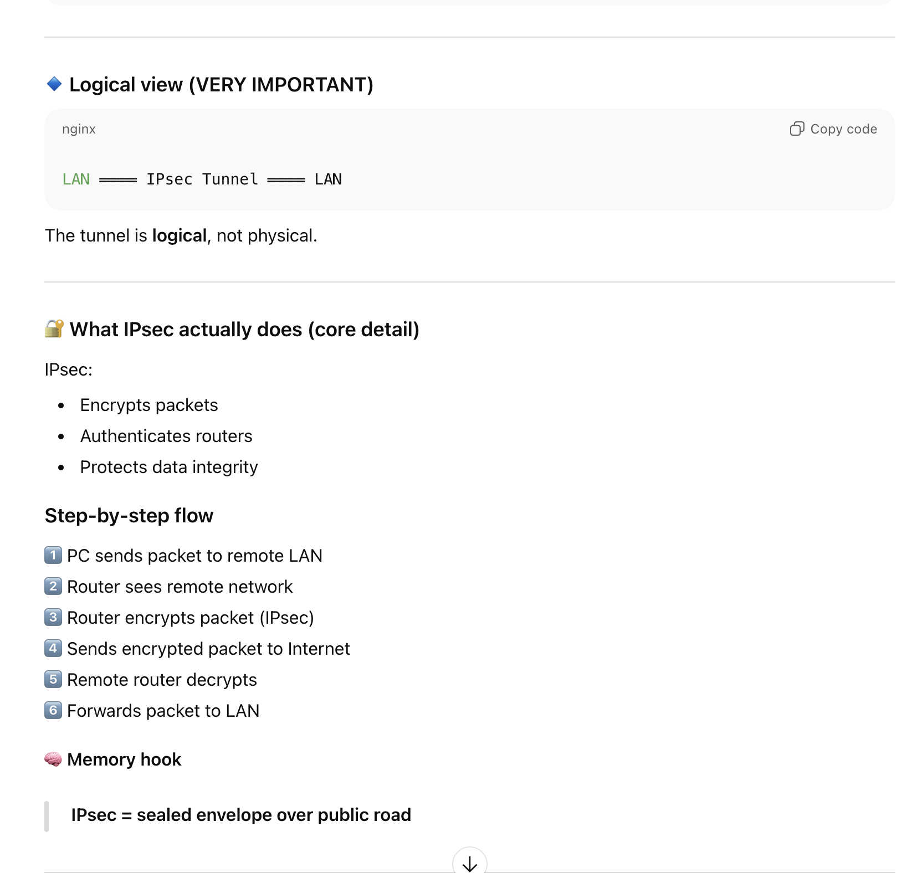
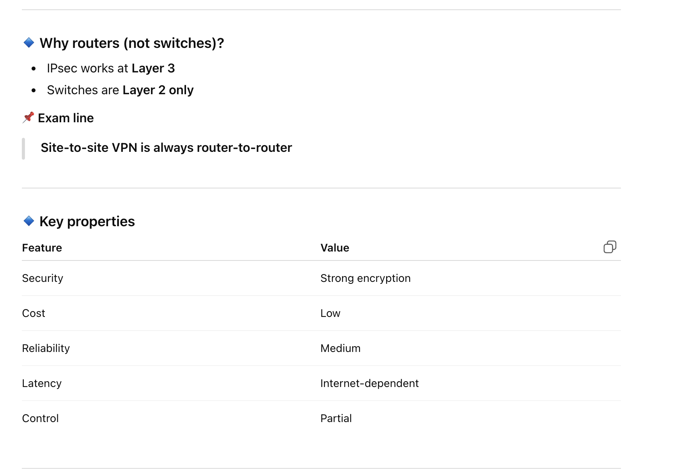

#
#
#
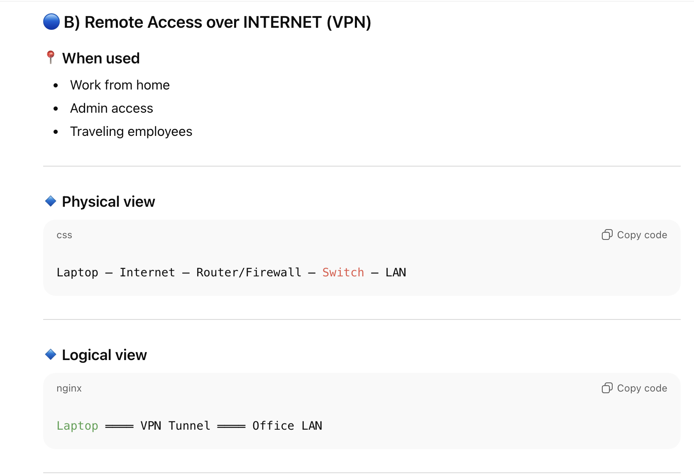
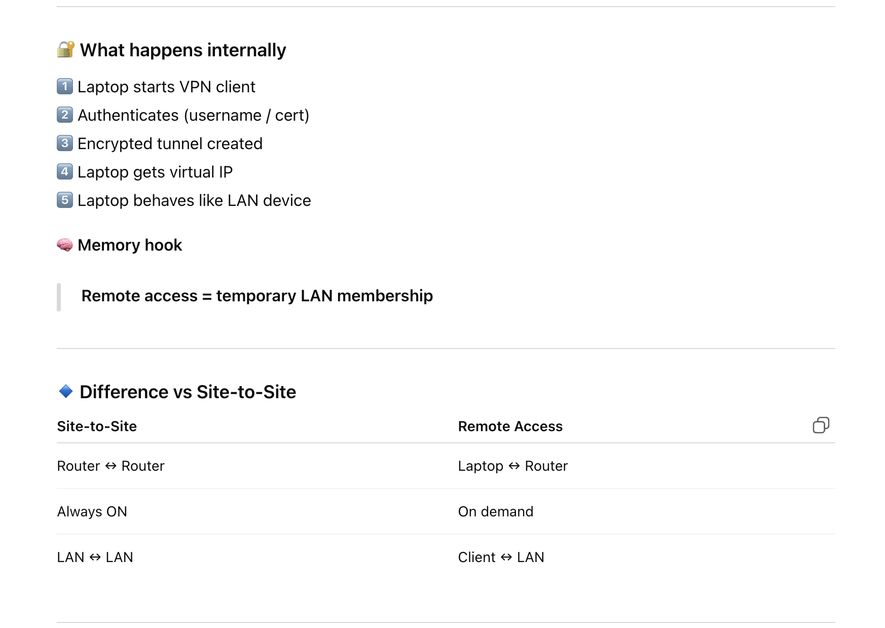
#
#
#
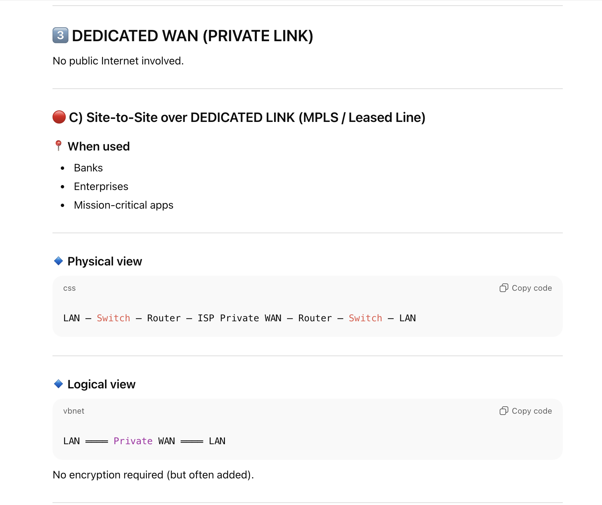
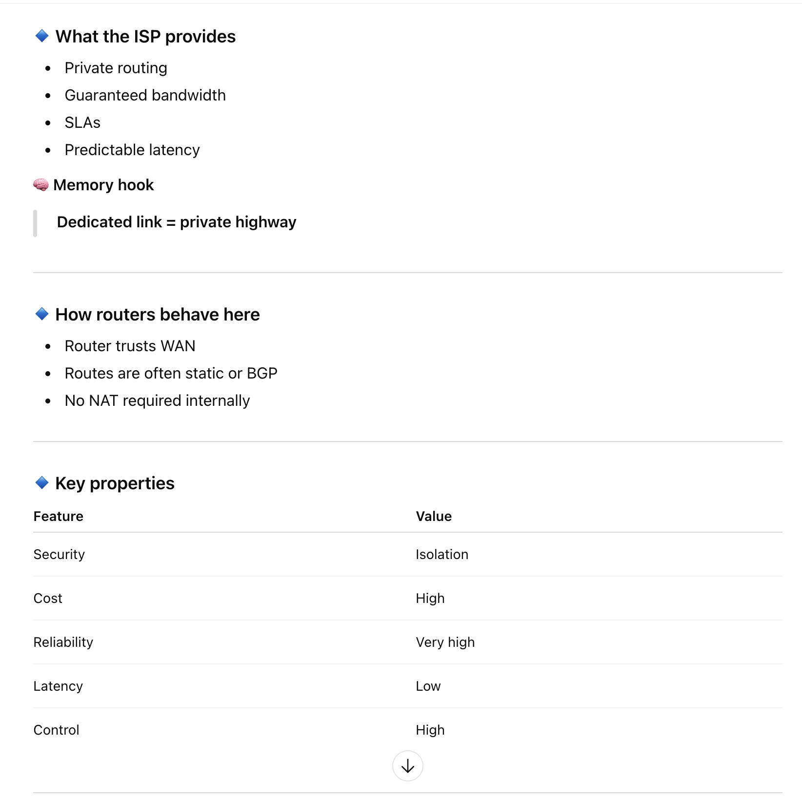
#
#
#
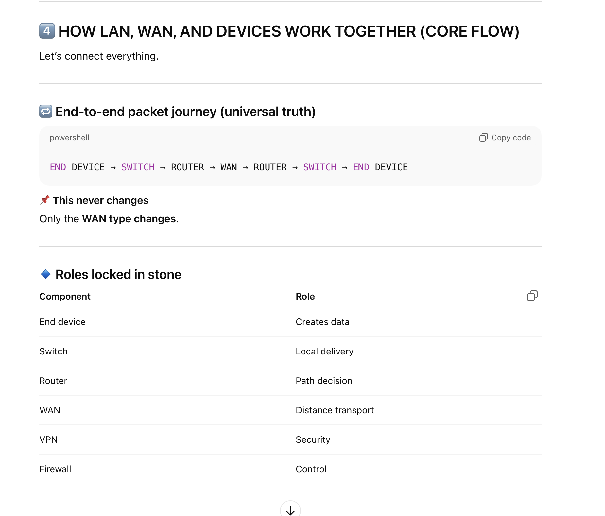
#
#
#
# 5️⃣ Why the Internet works globally 🌍 
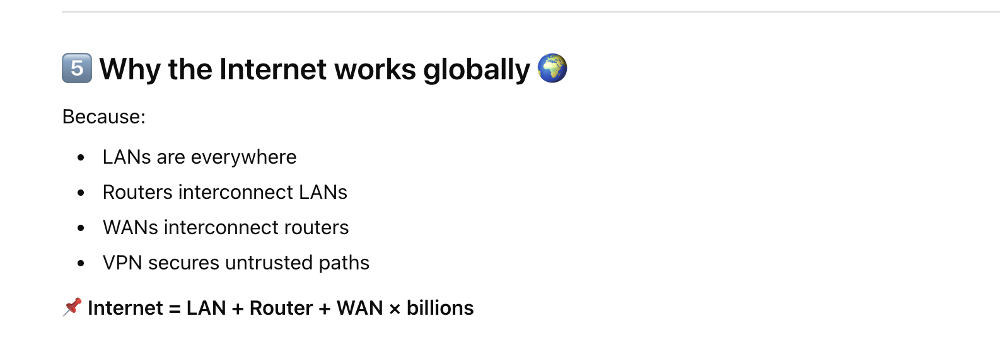

#
#
#
#
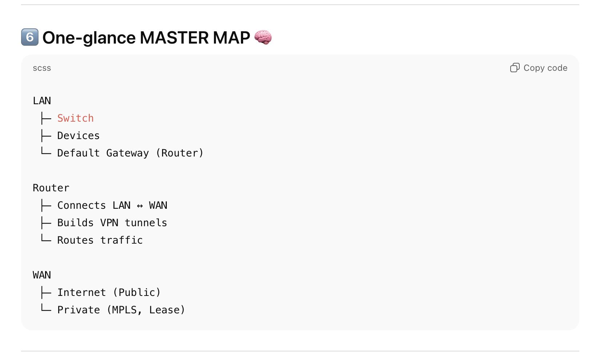

#
#
#
# 🔚 FINAL CRYSTAL SUMMARY (memorize)
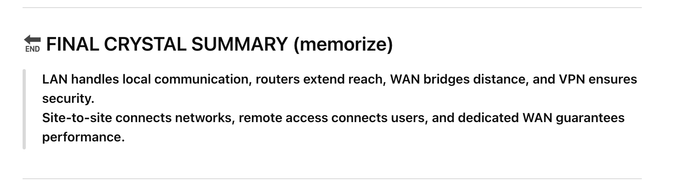

# Final Picture ##

