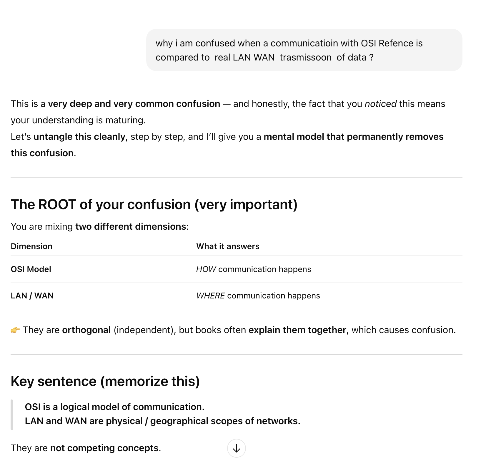

🌐 Networking Fundamentals — Clean Notes (OSI, LAN/WAN, Hop-by-Hop)

1️⃣ What OSI Model REALLY Is
* OSI (Open Systems Interconnection) is a logical reference model
* It explains HOW communication happens
* It does NOT describe physical paths or geography
* OSI layers represent responsibilities, not devices
OSI Layers (Top → Bottom)
1. Application
2. Presentation
3. Session
4. Transport (TCP / UDP)
5. Network (IP)
6. Data Link (Ethernet, MAC)
7. Physical (signals)
📌 OSI logic runs inside every device, but different devices stop at different layers

2️⃣ LAN and WAN — What They REALLY Mean
* LAN / WAN are NOT OSI layers
* They describe WHERE data travels, not HOW it works
Term	Meaning
LAN	Local network, single organization
WAN	Large network connecting multiple LANs
📌 WAN is an environment, not a protocol or layer📌 WAN uses OSI layers, mainly L1–L3

3️⃣ Packet Creation — Where It Happens
* Packet is first created inside the source device (Laptop/Server)
* Full OSI stack (L7 → L1) runs inside the laptop
* Data is wrapped layer by layer before leaving the device

Data
→ TCP Segment
→ IP Packet
→ Ethernet Frame
→ Bits

4️⃣ What Happens After Packet Leaves the Laptop
The packet does NOT stay unchanged during travel.
Key Rule:
OSI logic is applied multiple times at multiple devices

5️⃣ Device-wise OSI Layer Usage
Device	OSI Layers Used
Laptop / Server	L1–L7
Switch	L1–L2
Router	L1–L3
Firewall	L1–L4 (or L7)
6️⃣ What “Hop” Means
* A hop = communication between two directly connected devices
* Every hop is a Layer-2 transmission
Example:

Laptop → Switch   (1 hop)
Switch → Router   (1 hop)
Router → ISP Router (1 hop)

7️⃣ Ethernet — What It REALLY Is
* Ethernet is NOT just a cable
* Ethernet is a Layer-2 communication technology
* It defines:
    * Frames
    * MAC addresses
    * Local delivery rules
Ethernet can run over:
* Copper cable
* Fiber
* Wireless (Wi-Fi)
* ISP links

8️⃣ Why Ethernet Is Hop-to-Hop
* MAC addresses are local only
* Ethernet works only between direct neighbors
* At every hop, Ethernet headers change
📌 Ethernet cannot work end-to-end📌 Ethernet is intentionally limited

9️⃣ Switch vs Router (VERY IMPORTANT)
Switch
* Layer 2 device
* Uses MAC address table
* Forwards frames inside LAN
* Does NOT understand IP
Router
* Layer 3 device
* Uses routing table (IP based)
* Uses ARP table to get next-hop MAC
* Connects LANs and WANs
📌 Routers do not use MAC tables like switches

🔟 Router Hop-by-Hop Forwarding (WAN Travel)
During WAN travel:

Router A → Router B → Router C → Router D
At each router:
1. Remove old Ethernet (L2)
2. Read IP header (L3)
3. Decide next hop
4. Resolve next hop MAC (ARP)
5. Build new Ethernet frame
6. Send packet

1️⃣1️⃣ What Changes vs What Stays Same
Layer	Behavior Across Hops
Layer 1	Signals re-sent
Layer 2	❌ Stripped & rebuilt
Layer 3 (IP)	✔️ Preserved (TTL changes)
Layer 4 (TCP/UDP)	✔️ Preserved
Layer 5–7	✔️ Preserved
1️⃣2️⃣ Core Golden Statement (MEMORIZE)
Ethernet is hop-to-hop, IP is end-to-end
Meaning:
* Ethernet delivers data to the next device
* IP identifies the final destination

1️⃣3️⃣ Why WAN Is NOT a Layer
* WAN is a collection of routers and links
* WAN does NOT process packets
* Routers inside WAN apply OSI logic (L1–L3)
📌 WAN exists because:
* Distance
* Multiple ownership
* Routing across networks

1️⃣4️⃣ TCP vs UDP (From Our Discussion)
Use Case	Protocol
REST APIs	TCP
WebSockets	TCP
Video / Voice / Games	UDP
📌 TCP = reliable, ordered📌 UDP = fast, loss-tolerant

1️⃣5️⃣ Final Mental Model (LOCK THIS 🔒)
* OSI = HOW communication works
* LAN/WAN = WHERE communication travels
* Switch = local Ethernet forwarding
* Router = IP-based hop-by-hop forwarding
* WAN = many router hops
* IP = end-to-end identity
* Ethernet = local delivery only

🏆 One-line Ultimate Summary
Packets are created inside end devices, forwarded hop-by-hop using Ethernet at Layer 2, routed end-to-end using IP at Layer 3, and finally delivered to the destination where the full OSI stack is processed again.
